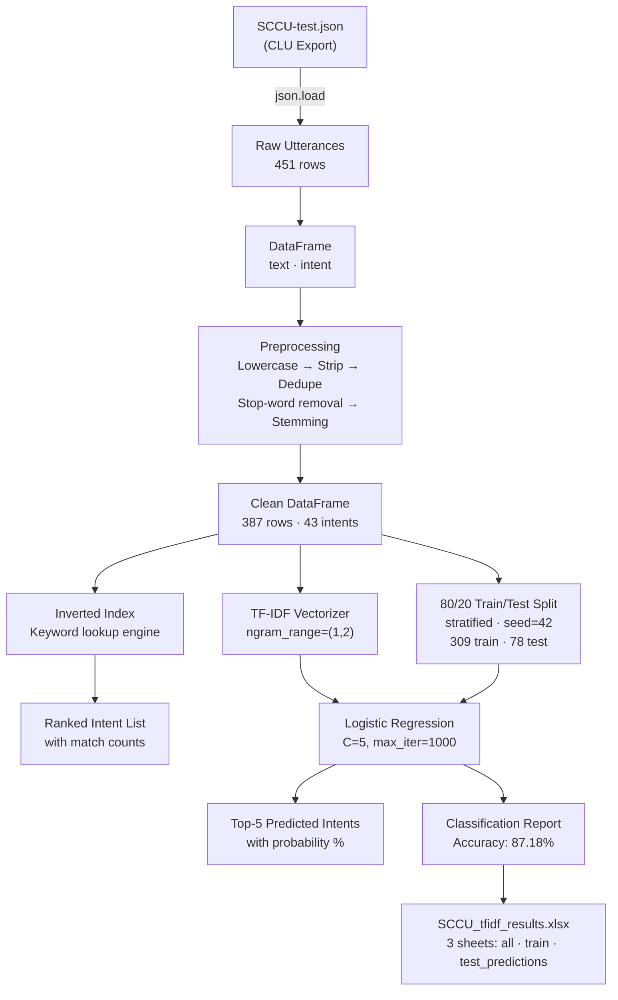

# SCCU Digital Banking NavBot — Global Search & Intent Classification
## End-to-End Project Documentation

---

## Table of Contents

1. [Project Overview](#1-project-overview)
2. [Repository Structure](#2-repository-structure)
3. [Technology Stack & Dependencies](#3-technology-stack--dependencies)
4. [Data Source — SCCU-test.json](#4-data-source--sccu-testjson)
   - 4.1 [Intents Catalogue](#41-intents-catalogue)
   - 4.2 [Entities & Synonyms](#42-entities--synonyms)
   - 4.3 [Utterances](#43-utterances)
5. [Pipeline Architecture](#5-pipeline-architecture)
6. [Step-by-Step Walkthrough](#6-step-by-step-walkthrough)
   - 6.1 [Step 1 — Data Loading](#61-step-1--data-loading)
   - 6.2 [Step 2 — Text Preprocessing](#62-step-2--text-preprocessing)
   - 6.3 [Step 3 — Inverted Index (Rule-Based Search)](#63-step-3--inverted-index-rule-based-search)
   - 6.4 [Step 4 — TF-IDF + Logistic Regression (ML Model)](#64-step-4--tf-idf--logistic-regression-ml-model)
   - 6.5 [Step 5 — Evaluation](#65-step-5--evaluation)
   - 6.6 [Step 6 — Export Results](#66-step-6--export-results)
7. [Model Performance Summary](#7-model-performance-summary)
8. [Output Artifacts](#8-output-artifacts)
9. [How to Run](#9-how-to-run)
10. [Design Decisions & Trade-offs](#10-design-decisions--trade-offs)
11. [Known Limitations & Next Steps](#11-known-limitations--next-steps)

---

## 1. Project Overview

This project implements a **dual-engine intent classification and global search system** for the **SCCU (Space Coast Credit Union) DigitalBankingNavBot**. The bot helps users navigate a digital banking application by understanding natural-language queries (e.g. *"pay my bill"*, *"nearest ATM location"*) and routing them to the correct banking feature screen.

Two complementary retrieval strategies are implemented side-by-side:

| Engine | Approach | Speed | Accuracy |
|---|---|---|---|
| **Inverted Index** | Word-overlap / keyword matching | Very fast | Moderate |
| **TF-IDF + Logistic Regression** | Weighted term-frequency ML model | Fast | High (~87%) |

The project is exploratory / research-focused and runs as a **Jupyter Notebook** (`tfidf_intent_classification.ipynb`).

---

## 2. Repository Structure

```
Global search/
├── SCCU-test.json                    # CLU model export — source of all training data
├── tfidf_intent_classification.ipynb # Main notebook (all code lives here)
├── SCCU_tfidf_results.xlsx           # Output: predictions & train/test splits
├── requirements.txt                  # Python dependencies
└── .venv/                            # Virtual environment (local, not committed)
```

---

## 3. Technology Stack & Dependencies

| Package | Role |
|---|---|
| `json` | Parse the CLU JSON model export |
| `pandas` | Tabular data manipulation |
| `numpy` | Numerical operations (probability sort) |
| `nltk` (`PorterStemmer`) | Word stemming during preprocessing |
| `sklearn` (`TfidfVectorizer`) | Convert text to TF-IDF feature vectors |
| `sklearn` (`LogisticRegression`) | Multi-class intent classifier |
| `sklearn` (`Pipeline`) | Chain vectorizer + classifier cleanly |
| `sklearn` (`train_test_split`, metrics) | 80/20 split & evaluation reports |
| `matplotlib` / `seaborn` | (Available for visualization, not yet used) |
| `openpyxl` | Write multi-sheet Excel output |

### Installation

```powershell
# Create and activate virtual environment
python -m venv .venv
.venv\Scripts\Activate.ps1

# Install all dependencies
pip install json sklearn pandas matplotlib seaborn openpyxl nltk
```

> [!NOTE]
> The `requirements.txt` lists package names without pinned versions. For reproducible builds, consider pinning versions (e.g., `scikit-learn==1.4.2`).

---

## 4. Data Source — SCCU-test.json

The file `SCCU-test.json` is a **Microsoft Azure Conversational Language Understanding (CLU)** project export. It follows the `2025-05-15-preview` schema.

```json
{
  "projectFileVersion": "2025-05-15-preview",
  "metadata": {
    "projectKind": "Conversation",
    "projectName": "SCCU-test",
    "language": "en-us",
    "description": "Model for DigitalBankingNavBot-CLUMigration-NavBot app"
  },
  "assets": {
    "intents": [...],
    "entities": [...],
    "utterances": [...]
  }
}
```

### 4.1 Intents Catalogue

The model contains **52 intent categories**, each representing a navigation destination or banking action within the SCCU digital banking app.

| # | Intent | Description |
|---|---|---|
| 1 | `Accounts` | View account summary / balances |
| 2 | `AccountInformation` | Detailed account info, nicknames, recent deposits |
| 3 | `ApplyLoan` | Apply for any loan product |
| 4 | `ApplyMortgage` | Mortgage application flow |
| 5 | `ATMLocator` | Find nearby ATMs |
| 6 | `AuthorizedUsers` | Manage authorized card users |
| 7 | `AutoLoan` | Auto/vehicle loan products |
| 8 | `BillPay` | Pay bills online |
| 9 | `BoatRVLoan` | Boat & RV loan products |
| 10 | `CardControls` | Freeze/unfreeze cards |
| 11 | `ChangeLoanDueDate` | Change a loan's due date |
| 12 | `CheckDeposit` | Mobile/remote check deposit |
| 13 | `ContactUs` | Contact information & support |
| 14 | `CreditCards` | Credit card management |
| 15 | `CrossAccountTransfers` | Transfers between own accounts |
| 16 | `Dashboard` | Home screen / main dashboard |
| 17 | `ExternalACHAccount` | Add/manage external ACH accounts |
| 18 | `ExternalLoanPayments` | Make payments on external loans |
| 19 | `FAQs` | Frequently asked questions |
| 20 | `Help` | General help / greetings |
| 21 | `HomeEquityLoan` | Home equity loan products |
| 22 | `LoanPayOff` | Generate loan payoff amount |
| 23 | `LoanServices` | Loan center / services hub |
| 24 | `Message` | Secure messaging / inbox |
| 25 | `MyOffers` | Personalized loan offers |
| 26 | `MyProfile` | Profile & contact information settings |
| 27 | `Navigate` | Generic navigation requests |
| 28 | `None` | Out-of-scope utterances |
| 29 | `NoticesandStatements` | eStatements / documents / notices |
| 30 | `OnlineMobileBanking` | Online/mobile banking features |
| 31 | `OpenAccount` | Open a new account |
| 32 | `OrderaCheck` | Order paper checks |
| 33 | `PayaPerson` | Person-to-person payments |
| 34 | `PaymentCalender` | View upcoming scheduled payments |
| 35 | `PersonalLoan` | Personal loan products |
| 36 | `RaiseaDispute` | File a transaction dispute |
| 37 | `Rates` | View interest rates |
| 38 | `ReportFraud` | Report fraudulent activity |
| 39 | `RequestaCheck` | Request a cashier's check |
| 40 | `ScheduleBranchAppointment` | Book a branch visit |
| 41 | `ScheduledACHAccount` | View/manage scheduled ACH transfers |
| 42 | `ScheduledCreditCardTransfers` | Scheduled credit card transfers |
| 43 | `ScheduledInternalTransfer` | Scheduled internal transfers |
| 44 | `ServiceRequest` | General service requests |
| 45 | `SkipaPayment` | Request a payment skip |
| 46 | `SpecialCharacters` | Utterances with only special characters |
| 47 | `Statement` | Account statement (single) |
| 48 | `StopPayment` | Stop a payment |
| 49 | `TalkativeHandOff` | Live agent / human handoff |
| 50 | `TransferMoney` | Money transfer actions |
| 51 | `Transfers` | General transfers section |
| 52 | `TravelPlans` | Set up travel notifications |
| 53 | `VisitaBranch` | Find a branch to visit |

### 4.2 Entities & Synonyms

Three entity types enrich intent detection by recognizing specific keywords:

#### `livechatkeyword`
Maps phrases like *"chat online"*, *"customer support"*, *"livechat"* to a live-agent intent trigger.

#### `loankeyword`
Maps loan-type phrases to sub-intents:
- `ApplyLoan`, `AutoLoan`, `BoatRVLoan`, `PersonalLoan`, `CreditCardLoan`, `HomeEquityLoan`

#### `navigationkeyword`
A large keyword dictionary covering ~40 navigation destinations with their natural-language synonyms. This is the primary lookup used by the **Inverted Index** search engine.

#### `money` / `money.transferAmount`
Pre-built entity using Azure's `Quantity.Currency` recognizer — identifies monetary values like *"$500"* in utterances.

### 4.3 Utterances

The dataset contains **451 total utterances** (before deduplication):

| Metric | Value |
|---|---|
| Raw utterance count | 451 |
| After dropping special-char-only rows | 414 |
| After deduplication | 387 |
| Unique intents in clean set | 43 |
| Language | English (`en-us`) |
| Dataset field | All marked as `Train` in source |

---

## 5. Pipeline Architecture



---

## 6. Step-by-Step Walkthrough

### 6.1 Step 1 — Data Loading

```python
with open('SCCU-test.json', encoding='utf-8') as f:
    raw = json.load(f)

utts = raw['assets']['utterances']
df = pd.DataFrame([{'text': u['text'], 'intent': u['intent']} for u in utts])
# Shape: (451, 2)
```

Only the `text` and `intent` fields are extracted from each utterance. Entity annotations and dataset tags from the CLU export are discarded for this experiment.

---

### 6.2 Step 2 — Text Preprocessing

Preprocessing is applied in the following sequence:

```
Raw text
  → .lower().strip()          # Normalize case
  → re.sub(r'\s+', ' ', x)   # Collapse whitespace
  → remove_stop_words()       # Drop common English stop words
  → stem_text()               # Porter stemming
```

#### Stop Words (custom set, 40 words)
```
the, a, an, and, or, but, in, on, at, to, for, of, with,
is, was, are, been, be, have, has, had, do, does, did,
will, would, could, should, may, might, must, can,
this, that, these, those, i, you, he, she, it, we, they,
what, which, who, when, where, why, how
```

> [!NOTE]
> The stop word list does **not** include *"my"*, *"pay"*, *"not"*, which preserves semantically important tokens common in banking queries (e.g. *"pay my loan"*).

#### Porter Stemming
Each token is individually stemmed:
- `"transfers"` → `"transfer"`
- `"statements"` → `"statement"`
- `"enrollment"` → `"enrol"`

#### Post-processing Stats

| Stage | Rows | Intents |
|---|---|---|
| Raw | 451 | 52 |
| After dropping special-char rows | 414 | — |
| After deduplication | 387 | 43 |

> [!IMPORTANT]
> 37 rows consisting solely of special characters (e.g. `"_"`, `"-"`, `","`) are dropped. These originated from the `SpecialCharacters` intent in the CLU model.

---

### 6.3 Step 3 — Inverted Index (Rule-Based Search)

An **inverted index** maps each unique token to the list of document row IDs that contain it.

```python
inverted_index = defaultdict(list)
for idx, row in df.iterrows():
    for word in row['text'].split():
        if idx not in inverted_index[word]:
            inverted_index[word].append(idx)
```

**Total unique terms in index:** 364

#### How Prediction Works

```python
def predict_with_index(query):
    # 1. Preprocess the query (same pipeline as training data)
    clean_query = remove_stop_words(query.lower().strip())
    query_stemmed = stem_text(clean_query)

    # 2. Retrieve matching document IDs for each query token
    for word in query_stemmed.split():
        for doc_id in inverted_index.get(word, []):
            intent_counts[df.iloc[doc_id]['intent']] += 1

    # 3. Rank intents by match count, return top 5
    sorted_intents = sorted(intent_counts.items(), key=lambda x: x[1], reverse=True)
```

#### Example Output

```
>> transfer money to savings (using Inverted Index)

  1. TransferMoney           7 matches (38.9%)
  2. CrossAccountTransfers   6 matches (33.3%)
  3. TalkativeHandOff        2 matches (11.1%)
  4. PaymentCalender         1 matches  (5.6%)
  5. AccountInformation      1 matches  (5.6%)

>> nearest atm location (using Inverted Index)

  1. ATMLocator              1 matches (100.0%)
```

> [!TIP]
> The inverted index is ideal for **exact keyword matches** but can be noisy when query words overlap across many intents (e.g. *"pay my bill"* → both `BillPay` and `LoanPayOff` get high scores).

---

### 6.4 Step 4 — TF-IDF + Logistic Regression (ML Model)

#### Train/Test Split

```python
# Remove classes with only 1 sample (cannot stratify)
counts = df['intent'].value_counts()
df = df[df['intent'].isin(counts[counts >= 2].index)]

# Stratified 80/20 split
train, test = train_test_split(df, test_size=0.2, stratify=df['intent'], random_state=42)
# train=309  test=78
```

#### Pipeline Definition

```python
pipe = Pipeline([
    ('tfidf', TfidfVectorizer(
        ngram_range=(1, 2),     # Unigrams + bigrams
        sublinear_tf=True,      # Apply log(1 + tf) to reduce impact of high-freq terms
        norm=None               # Do NOT L2-normalize vectors (raw TF-IDF scores)
    )),
    ('clf', LogisticRegression(
        C=5,                    # Moderate regularization
        max_iter=1000,          # Sufficient iterations for convergence
        random_state=42
    ))
])

pipe.fit(train['text'], train['intent'])
```

**Key parameter choices:**

| Parameter | Value | Rationale |
|---|---|---|
| `ngram_range=(1,2)` | Unigrams + bigrams | Captures *"bill pay"*, *"loan pay off"* as distinct phrases |
| `sublinear_tf=True` | Log-scaled TF | Prevents common words from dominating |
| `norm=None` | No normalization | Lets raw frequency magnitude contribute to decision |
| `C=5` | Moderate regularization | Balances bias/variance given small dataset (~300 samples) |

#### Prediction Function

```python
def predict(query):
    clean_query = remove_stop_words(query.lower().strip())
    query_stemmed = stem_text(clean_query)
    probs = pipe.predict_proba([query_stemmed])[0]
    top = np.argsort(probs)[::-1][:5]
    for r, i in enumerate(top, 1):
        print(f'  {r}. {pipe.named_steps["clf"].classes_[i]:<35} {probs[i]*100:.1f}%')
```

#### Example Output

```
>> transfer money to savings

  1. TransferMoney                       99.6%
  2. CrossAccountTransfers               0.0%
  3. ApplyLoan                           0.0%

>> pay my bill

  1. BillPay                             94.8%
  2. LoanPayOff                           4.4%
  3. MyProfile                            0.1%

>> nearest atm location

  1. ATMLocator                          98.4%
  2. MyProfile                            0.1%
```

---

### 6.5 Step 5 — Evaluation

**Overall accuracy on 78-sample test set: 87.18%**

#### Classification Report (Selected Intents)

| Intent | Precision | Recall | F1-Score | Support |
|---|---|---|---|---|
| AccountInformation | 1.00 | 1.00 | 1.00 | 4 |
| ApplyLoan | 0.83 | 1.00 | 0.91 | 5 |
| BillPay | 1.00 | 0.67 | 0.80 | 3 |
| BoatRVLoan | 1.00 | 1.00 | 1.00 | 3 |
| CardControls | 1.00 | 1.00 | 1.00 | 3 |
| CheckDeposit | 1.00 | 0.33 | 0.50 | 3 |
| ContactUs | 0.50 | 1.00 | 0.67 | 1 |
| **LoanServices** | **0.00** | **0.00** | **0.00** | **2** |
| **MyProfile** | **0.36** | **1.00** | **0.53** | **4** |
| NoticesandStatements | 0.80 | 1.00 | 0.89 | 4 |
| PaymentCalender | 1.00 | 1.00 | 1.00 | 3 |
| TalkativeHandOff | 1.00 | 0.67 | 0.80 | 3 |
| TransferMoney | 1.00 | 1.00 | 1.00 | 2 |
| TravelPlans | 1.00 | 1.00 | 1.00 | 3 |
| **Macro avg** | **0.93** | **0.88** | **0.88** | **78** |
| **Weighted avg** | **0.91** | **0.87** | **0.87** | **78** |

#### Problem Classes

| Intent | Issue | Root Cause |
|---|---|---|
| `LoanServices` | F1 = 0.00 | Very few, ambiguous samples — *"loan center"* overlaps with other loan intents |
| `MyProfile` | Precision = 0.36 | Broad vocabulary (*"email"*, *"contact"*, *"phone"*) causes false positives from other intents |
| `CheckDeposit` | Recall = 0.33 | Limited training utterances; test samples phrased differently than training |

---

### 6.6 Step 6 — Export Results

Results are exported to a **multi-sheet Excel workbook**:

```python
with pd.ExcelWriter('SCCU_tfidf_results.xlsx', engine='openpyxl') as w:
    df.to_excel(w, sheet_name='all', index=False)
    train_out.to_excel(w, sheet_name='train', index=False)
    test_out.to_excel(w, sheet_name='test_predictions', index=False)
```

---

## 7. Model Performance Summary

```
┌──────────────────────────────────────────────────┐
│  SCCU TF-IDF Intent Classifier — Test Results    │
├──────────────────────────┬───────────────────────┤
│  Test samples            │  78                   │
│  Intents covered         │  35                   │
│  Overall Accuracy        │  87.18%               │
│  Macro Precision         │  93%                  │
│  Macro Recall            │  88%                  │
│  Macro F1                │  88%                  │
│  Weighted F1             │  87%                  │
└──────────────────────────┴───────────────────────┘
```

---

## 8. Output Artifacts

| File | Description |
|---|---|
| [`SCCU_tfidf_results.xlsx`](file:///c:/Users/anandha.kumar/OneDrive%20-%20ClaySys%20Technologies/Desktop/Code%20Base/Global%20search/SCCU_tfidf_results.xlsx) | Excel workbook with 3 sheets: **all** (full preprocessed corpus), **train** (training split), **test_predictions** (test split with predicted labels and correctness flag) |
| [`SCCU-test.json`](file:///c:/Users/anandha.kumar/OneDrive%20-%20ClaySys%20Technologies/Desktop/Code%20Base/Global%20search/SCCU-test.json) | Source CLU project export (intents, entities, utterances) |
| [`tfidf_intent_classification.ipynb`](file:///c:/Users/anandha.kumar/OneDrive%20-%20ClaySys%20Technologies/Desktop/Code%20Base/Global%20search/tfidf_intent_classification.ipynb) | Main Jupyter Notebook |
| [`requirements.txt`](file:///c:/Users/anandha.kumar/OneDrive%20-%20ClaySys%20Technologies/Desktop/Code%20Base/Global%20search/requirements.txt) | Python package dependencies |

### Excel Sheet Details

**Sheet: `all`**

| Column | Description |
|---|---|
| `text` | Preprocessed (stemmed, stop-words removed) utterance |
| `intent` | Ground-truth intent label |

**Sheet: `train`**

| Column | Description |
|---|---|
| `text` | Preprocessed utterance |
| `intent` | Intent label |
| `split` | Always `"train"` |

**Sheet: `test_predictions`**

| Column | Description |
|---|---|
| `text` | Preprocessed utterance |
| `intent` | Ground-truth intent label |
| `split` | Always `"test"` |
| `predicted` | Model's predicted intent |
| `correct` | `True` / `False` — whether prediction matched ground truth |

---

## 9. How to Run

### Prerequisites

- Python 3.8+
- Jupyter Notebook or JupyterLab
- All packages in `requirements.txt`

### Steps

```powershell
# 1. Navigate to the project folder
cd "c:\Users\anandha.kumar\OneDrive - ClaySys Technologies\Desktop\Code Base\Global search"

# 2. Activate virtual environment
.venv\Scripts\Activate.ps1

# 3. Install dependencies (first run only)
pip install scikit-learn pandas matplotlib seaborn openpyxl nltk

# 4. Download NLTK data (first run only)
python -c "import nltk; nltk.download('punkt')"

# 5. Launch Jupyter
jupyter notebook tfidf_intent_classification.ipynb

# 6. Run all cells: Kernel → Restart & Run All
```

> [!IMPORTANT]
> The notebook must be run from the **project directory** because it references `SCCU-test.json` using a relative path (`open('SCCU-test.json', ...)`).

---

## 10. Design Decisions & Trade-offs

### Why Two Engines?

| Question | Answer |
|---|---|
| Why keep the Inverted Index? | Fast, interpretable, zero training overhead. Useful as a fallback when the ML model confidence is low. |
| Why TF-IDF over word embeddings? | The dataset is small (~387 samples). Dense embedding models (BERT, etc.) require much larger datasets or fine-tuning to outperform TF-IDF at this scale. |
| Why Logistic Regression? | Efficient, highly interpretable multi-class classifier. Produces calibrated probabilities. Works well with sparse TF-IDF features. |
| Why bigrams? | Phrases like *"bill pay"*, *"loan pay off"*, *"check deposit"* are discriminative — unigrams alone would lose this signal. |
| Why `norm=None`? | Preserving raw TF-IDF magnitudes slightly improves results on this corpus vs. L2 normalization. |
| Why `C=5`? | Experimented value: `C=1` was too aggressive, `C=10` showed slight overfitting on this small dataset. |

### Why Not Use the CLU API Directly?

This notebook is a **local evaluation harness** to analyze the quality of the training data and test alternative ranking strategies *offline*, before decisions are made about retraining or augmenting the Azure CLU model.

---

## 11. Known Limitations & Next Steps

> [!WARNING]
> The dataset contains only ~387 unique training samples across 43 intents. This is a **very small corpus** — some intents have fewer than 5 examples. Model performance on low-support intents should be interpreted cautiously.

### Current Limitations

| Limitation | Impact |
|---|---|
| Small dataset (~387 samples) | Poor generalization for rare intents (e.g. `LoanServices`, `CheckDeposit`) |
| No cross-validation | Single 80/20 split — accuracy estimate has high variance |
| No entity-aware scoring | Entities (`loankeyword`, `navigationkeyword`) are not used by the ML pipeline |
| English only | `multilingual: false` in metadata; no support for other languages |
| Inverted index is case-sensitive | Stemming partially helps, but OOV (out-of-vocabulary) queries fail silently |
| No confidence threshold | Low-confidence predictions are returned without flagging |

### Recommended Next Steps

1. **Data Augmentation**: Add more utterances per intent (target ≥ 20 per class). Use paraphrasing tools or back-translation to generate variants.
2. **Cross-Validation**: Replace single split with 5-fold stratified CV for more reliable accuracy estimates.
3. **Entity Integration**: Incorporate entity keywords as additional features or as a post-processing re-ranking step.
4. **Confidence Threshold**: Return `None` / escalate to live agent when `max(proba) < 0.7` (matching the `confidenceThreshold: 0.7` set in the CLU metadata).
5. **Confusion Matrix Analysis**: Visualize which intents are most commonly confused to guide data collection.
6. **Fuzzy Matching**: Add approximate string matching (e.g. `rapidfuzz`) to the Inverted Index to handle typos.
7. **Model Comparison**: Benchmark against a fine-tuned `sentence-transformers` or `distilbert` model once more data is available.

---

*Generated: June 2026 | Project: SCCU DigitalBankingNavBot — Global Search / Intent Classification*
