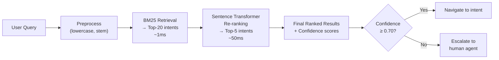

# SCCU Intent Classifier — Metrics Evaluation & New Methods Report

> **Companion to:** SCCU Global Search & Intent Classification — End-to-End Project Documentation
> **Scope:** Critiques every metric currently in use, identifies gaps, and proposes new metrics and modelling approaches with detailed reasoning.

---

## Table of Contents

1. [Current Evaluation Setup — A Critique](#1-current-evaluation-setup--a-critique)
2. [Deep-Dive: Metrics Currently Used](#2-deep-dive-metrics-currently-used)
   - 2.1 [Accuracy](#21-accuracy)
   - 2.2 [Precision (per class)](#22-precision-per-class)
   - 2.3 [Recall (per class)](#23-recall-per-class)
   - 2.4 [F1-Score (per class)](#24-f1-score-per-class)
   - 2.5 [Macro Average](#25-macro-average)
   - 2.6 [Weighted Average](#26-weighted-average)
   - 2.7 [Support](#27-support)
3. [Critical Gaps in Current Metrics](#3-critical-gaps-in-current-metrics)
4. [Recommended New Evaluation Metrics](#4-recommended-new-evaluation-metrics)
   - 4.1 [Top-K Accuracy](#41-top-k-accuracy)
   - 4.2 [Mean Reciprocal Rank (MRR)](#42-mean-reciprocal-rank-mrr)
   - 4.3 [Normalised Discounted Cumulative Gain (NDCG)](#43-normalised-discounted-cumulative-gain-ndcg)
   - 4.4 [Expected Calibration Error (ECE)](#44-expected-calibration-error-ece)
   - 4.5 [Cohen's Kappa (κ)](#45-cohens-kappa-κ)
   - 4.6 [Matthews Correlation Coefficient (MCC)](#46-matthews-correlation-coefficient-mcc)
   - 4.7 [Confusion Matrix Visualisation](#47-confusion-matrix-visualisation)
   - 4.8 [Stratified K-Fold Cross-Validation](#48-stratified-k-fold-cross-validation)
   - 4.9 [Confidence Threshold Analysis (PR Curve)](#49-confidence-threshold-analysis-pr-curve)
5. [Problems with the Current Model Architecture](#5-problems-with-the-current-model-architecture)
6. [Recommended New Modelling Methods](#6-recommended-new-modelling-methods)
   - 6.1 [Support Vector Machine (SVM)](#61-support-vector-machine-svm)
   - 6.2 [BM25+ Retrieval (Better Inverted Index)](#62-bm25-retrieval-better-inverted-index)
   - 6.3 [Sentence Transformers (Semantic Similarity)](#63-sentence-transformers-semantic-similarity)
   - 6.4 [SetFit (Few-Shot Fine-Tuning)](#64-setfit-few-shot-fine-tuning)
   - 6.5 [Hybrid Re-Ranking Pipeline](#65-hybrid-re-ranking-pipeline)
   - 6.6 [LLM-based Intent Routing (Zero-Shot)](#66-llm-based-intent-routing-zero-shot)
7. [Method Comparison Matrix](#7-method-comparison-matrix)
8. [Recommended Adoption Roadmap](#8-recommended-adoption-roadmap)
9. [Summary Verdict](#9-summary-verdict)

---

## 1. Current Evaluation Setup — A Critique

The current evaluation in `tfidf_intent_classification.ipynb` uses a **single 80/20 train/test split** (309 train, 78 test) with `random_state=42`, and reports `sklearn.metrics.classification_report`.

### What is being measured today

```python
preds = pipe.predict(test['text'])
print('accuracy:', round(accuracy_score(test['intent'], preds), 4))
print(classification_report(test['intent'], preds, zero_division=0))
```

This gives:
- Overall accuracy (single number)
- Per-class precision, recall, F1-score, support
- Macro and weighted averages

### Why this is insufficient

> [!WARNING]
> **78 test samples across 35 classes** means on average **2.2 test samples per class**. A single correct or incorrect prediction swings a class F1-score by ±50% or more. The reported 87.18% accuracy is highly sensitive to this specific random split. A different `random_state` could yield 80% or 93%.

The current setup:
1. Reports accuracy on an **imbalanced** multi-class problem where it is misleading
2. Uses **no cross-validation** — the single test set is too small to trust
3. Does **not measure ranking quality** — the system always returns a ranked Top-5 list, but only the Top-1 is evaluated
4. Does **not measure confidence calibration** — probabilities are reported but never audited
5. Has **no "I don't know" mechanism** — there is no threshold at which the model abstains

---

## 2. Deep-Dive: Metrics Currently Used

### 2.1 Accuracy

**Formula:**
```
Accuracy = (Number of Correct Predictions) / (Total Predictions)
         = 68 / 78 = 87.18%
```

**What it measures:** The proportion of all test queries classified into the exact correct intent.

**Why it is useful here:**
- Simple to interpret for stakeholders
- Works reasonably well when classes are roughly balanced

**Why it is problematic here:**

| Problem | Detail |
|---|---|
| Class imbalance | Some intents have 1 test sample, others have 5. A model that always predicts the majority class scores high. |
| Hides per-class failures | `LoanServices` has F1=0.00 (total failure), but this barely moves the overall 87% number |
| Small test set | 78 samples → ±5-6% confidence interval on the accuracy estimate |
| Binary view | A model predicting the 2nd-most-likely class gets 0 credit, even though the user's intent was "almost right" |

**Verdict:** ⚠️ Necessary but not sufficient. Do not use it as the primary metric.

---

### 2.2 Precision (per class)

**Formula:**
```
Precision(class C) = TP_C / (TP_C + FP_C)
```

**What it measures:** Of all queries the model *claimed* were intent C, what fraction truly were?

**Example from results:**

| Intent | Precision | Interpretation |
|---|---|---|
| `MyProfile` | 0.36 | The model incorrectly fires `MyProfile` for 64% of queries it assigns to it — very noisy |
| `ContactUs` | 0.50 | 1 in 2 predictions for ContactUs is wrong |
| `LoanServices` | 0.00 | Every single `LoanServices` prediction was wrong |

**When low precision matters:** In a banking chatbot, false positive navigations frustrate users — sending them to the wrong screen when they asked for something else.

**Verdict:** ✅ Relevant and should stay. Low precision = too many wrong navigations.

---

### 2.3 Recall (per class)

**Formula:**
```
Recall(class C) = TP_C / (TP_C + FN_C)
```

**What it measures:** Of all queries that *actually* belonged to intent C, what fraction did the model correctly identify?

**Example from results:**

| Intent | Recall | Interpretation |
|---|---|---|
| `CheckDeposit` | 0.33 | The model missed 2 out of 3 genuine "check deposit" requests |
| `BillPay` | 0.67 | 1 in 3 genuine "bill pay" requests was misclassified |
| `Help` | 0.50 | Half of all greeting/help queries were missed |

**When low recall matters:** Missing a genuine user intent means the user is not routed anywhere helpful — they must rephrase or give up.

**Verdict:** ✅ Relevant and should stay. Low recall = users left unserved.

---

### 2.4 F1-Score (per class)

**Formula:**
```
F1 = 2 × (Precision × Recall) / (Precision + Recall)
```

**What it measures:** Harmonic mean of precision and recall — penalises extreme imbalance between the two.

**Why harmonic mean and not arithmetic mean?**
- Arithmetic mean of Precision=1.0 and Recall=0.0 gives 0.5 — falsely suggesting moderate performance
- Harmonic mean gives 0.0 — correctly indicating the model is useless for that class

**Weakness for this project:**
- With 1-sample support classes, F1 is either 0.0 or 1.0 — no nuance
- Does not account for ranking: a model that puts the right answer 2nd gets no credit

**Verdict:** ✅ Keep as primary per-class metric, but supplement with Top-K accuracy.

---

### 2.5 Macro Average

**Formula:**
```
Macro F1 = (1/N) × Σ F1(class_i)  for all N classes
```

**What it measures:** Unweighted average of F1 across all classes — treats every intent equally regardless of how many examples it has.

**Current result:** Macro F1 = 0.88

**Why this matters:**
- Macro avg forces the model to perform well on *all* intents, including rare ones
- A class with 1 test sample and F1=0 pulls down the macro avg equally with a class of 20 samples

**Why it is still misleading here:**
- With many 1-2 sample classes, a single wrong prediction causes a class F1 of 0.0 — this disproportionately punishes the macro average, making it noisy

**Verdict:** ⚠️ Keep but interpret with caution given tiny per-class support. Supplement with cross-validation for stable estimates.

---

### 2.6 Weighted Average

**Formula:**
```
Weighted F1 = Σ (support_i / total_support) × F1(class_i)
```

**What it measures:** F1 weighted by how many test samples each class has — classes with more samples have more influence.

**Current result:** Weighted F1 = 0.87

**Problem:** This is almost identical to overall accuracy in this dataset, because test support is so low per class. It does not reveal the catastrophic failure on `LoanServices` (F1=0, support=2).

**Verdict:** ⚠️ Less informative than macro avg here. Can be de-emphasised.

---

### 2.7 Support

**What it measures:** Number of test samples belonging to each intent.

**The core problem:**

```
Min support: 1 (many classes)
Max support: 5 (ApplyLoan)
Mean support: 78 / 35 ≈ 2.2 samples per class
```

> [!CAUTION]
> With only 1-2 test samples per class, **no metric is statistically reliable**. A 90% recall on a class with 10 samples is meaningful. A 100% recall on a class with 1 sample tells you almost nothing.

**What to do:** Increase the dataset and use K-fold cross-validation so every sample is eventually tested.

---

## 3. Critical Gaps in Current Metrics

| Gap | Why It Matters for This Project |
|---|---|
| **No Top-K accuracy** | The system returns a ranked Top-5. If the right answer is #2, the user can still self-correct. Top-1 only evaluation underestimates real-world utility. |
| **No ranking quality metric (MRR/NDCG)** | The Inverted Index is specifically a ranking system — it is never evaluated. We don't know if rank-1 is usually right or rank-3. |
| **No calibration metric (ECE)** | The model's 99.6% confidence on `TransferMoney` is only useful if it's actually right 99.6% of the time. Uncalibrated probabilities cause over/under-triggering of confidence thresholds. |
| **No "None/fallback" evaluation** | How does the model behave on completely unknown queries (e.g. "hello what time is it")? The `None` intent is not in the test set. |
| **No cross-validation** | Single test split with 78 samples has ~±5-6% variance. Results are not reproducible across different splits. |
| **No out-of-scope detection metric** | A banking bot must know when a query is irrelevant. There is no metric for this. |
| **No latency metric** | For a production chatbot, response time matters. Not measured at all. |
| **Inverted Index never numerically evaluated** | The inverted index is shown with examples but never given a precision/recall/MRR score. |

---

## 4. Recommended New Evaluation Metrics

### 4.1 Top-K Accuracy

**What it measures:** Whether the correct intent appears anywhere in the model's Top-K ranked predictions.

**Why it is critical here:**
The system already outputs a ranked Top-5 list. In a real chatbot, if the model's 2nd or 3rd suggestion is shown to the user (e.g. "Did you mean: Bill Pay?"), a Top-3 match is still a success.

**Formula:**
```
Top-K Accuracy = |queries where correct intent ∈ Top-K predictions| / |total queries|
```

**Implementation:**
```python
from sklearn.preprocessing import LabelEncoder

# Get probability matrix
proba_matrix = pipe.predict_proba(test['text'])    # shape: (78, num_classes)
classes = pipe.named_steps['clf'].classes_

# Encode true labels as indices
le = LabelEncoder().fit(classes)
true_indices = le.transform(test['intent'])

# Top-K accuracy
def top_k_accuracy(proba_matrix, true_indices, k):
    top_k_preds = np.argsort(proba_matrix, axis=1)[:, -k:]  # top K indices
    correct = sum(true_indices[i] in top_k_preds[i] for i in range(len(true_indices)))
    return correct / len(true_indices)

print(f"Top-1 Accuracy: {top_k_accuracy(proba_matrix, true_indices, 1):.4f}")
print(f"Top-3 Accuracy: {top_k_accuracy(proba_matrix, true_indices, 3):.4f}")
print(f"Top-5 Accuracy: {top_k_accuracy(proba_matrix, true_indices, 5):.4f}")
```

**Expected insight:** Top-3 accuracy is likely 93-96%, revealing that the model's ranking is often correct even when Top-1 is wrong.

**Priority:** 🔴 **HIGH** — must add immediately.

---

### 4.2 Mean Reciprocal Rank (MRR)

**What it measures:** On average, at what rank does the correct intent appear?

**Formula:**
```
MRR = (1/|Q|) × Σ (1 / rank_i)
```

Where `rank_i` is the position (1, 2, 3, ...) of the correct intent in the ranked list.

**Interpretation:**
| MRR | Meaning |
|---|---|
| 1.00 | Correct intent is always #1 |
| 0.50 | Correct intent is on average at rank 2 |
| 0.33 | Correct intent is on average at rank 3 |

**Why it matters for this project:**
- MRR directly measures the ranking quality of both the Inverted Index and the TF-IDF model
- Allows direct comparison between the two engines on a fair scale

**Implementation:**
```python
def mean_reciprocal_rank(proba_matrix, true_indices):
    ranks = []
    for i in range(len(true_indices)):
        sorted_indices = np.argsort(proba_matrix[i])[::-1]   # descending rank
        rank = np.where(sorted_indices == true_indices[i])[0][0] + 1
        ranks.append(1.0 / rank)
    return np.mean(ranks)

mrr = mean_reciprocal_rank(proba_matrix, true_indices)
print(f"MRR: {mrr:.4f}")
```

**Priority:** 🔴 **HIGH** — essential for evaluating the ranking system.

---

### 4.3 Normalised Discounted Cumulative Gain (NDCG)

**What it measures:** A ranked-list quality metric that penalises relevant results ranked lower, with logarithmic discounting.

**Formula:**
```
DCG@k  = Σ (rel_i / log2(i + 1))   for i = 1..k
NDCG@k = DCG@k / IDCG@k             (IDCG = ideal DCG, where rel_i = 1 only at rank 1)
```

**When to use it:** NDCG is especially useful when you want to reward getting the right answer at rank 2 slightly, and rank 5 only a little — MRR is a binary pass/fail per query position.

**Implementation:**
```python
from sklearn.metrics import ndcg_score

# Build binary relevance matrix (1 if correct class, 0 otherwise)
n_classes = len(classes)
true_relevance = np.zeros((len(true_indices), n_classes))
for i, t in enumerate(true_indices):
    true_relevance[i, t] = 1

ndcg_5 = ndcg_score(true_relevance, proba_matrix, k=5)
print(f"NDCG@5: {ndcg_5:.4f}")
```

**Priority:** 🟡 **MEDIUM** — valuable once Top-K and MRR are in place.

---

### 4.4 Expected Calibration Error (ECE)

**What it measures:** How well the model's confidence probabilities reflect actual accuracy. If the model says 90% confident on 100 queries, exactly 90 should be correct.

**Formula:**
```
ECE = Σ (|B_m| / n) × |acc(B_m) - conf(B_m)|
```

Where queries are grouped into confidence bins B_m.

**Why it is critical for this project:**
- The CLU metadata already sets `confidenceThreshold: 0.7`
- If the model's 70% confidence actually corresponds to only 50% accuracy, the threshold is misconfigured
- A well-calibrated model's probabilities can directly drive the "escalate to human agent" decision

**Implementation:**
```python
def expected_calibration_error(y_true, y_proba, n_bins=10):
    max_probs = np.max(y_proba, axis=1)
    predictions = np.argmax(y_proba, axis=1)
    correct = (predictions == y_true).astype(int)

    bins = np.linspace(0, 1, n_bins + 1)
    ece = 0.0
    for i in range(n_bins):
        mask = (max_probs >= bins[i]) & (max_probs < bins[i+1])
        if mask.sum() > 0:
            bin_acc  = correct[mask].mean()
            bin_conf = max_probs[mask].mean()
            ece += (mask.sum() / len(y_true)) * abs(bin_acc - bin_conf)
    return ece

ece = expected_calibration_error(true_indices, proba_matrix)
print(f"Expected Calibration Error: {ece:.4f}")
# ECE < 0.05 = well-calibrated; ECE > 0.10 = poorly calibrated
```

**Priority:** 🔴 **HIGH** — directly informs the confidence threshold setting.

---

### 4.5 Cohen's Kappa (κ)

**What it measures:** Agreement between predictions and ground truth, adjusted for the agreement expected by chance.

**Formula:**
```
κ = (p_o - p_e) / (1 - p_e)

p_o = observed accuracy
p_e = expected accuracy if predictions were random (based on class frequencies)
```

**Interpretation:**
| κ value | Interpretation |
|---|---|
| < 0.20 | Slight agreement (barely better than random) |
| 0.20–0.40 | Fair |
| 0.40–0.60 | Moderate |
| 0.60–0.80 | Substantial ✅ |
| > 0.80 | Almost perfect ✅✅ |

**Why it matters here:**
- With 43 intents, a random baseline could still achieve ~2-3% accuracy by chance
- Accuracy of 87% sounds good — but kappa tells you how much of that is above chance
- Especially important because the dataset is not uniformly distributed

**Implementation:**
```python
from sklearn.metrics import cohen_kappa_score
kappa = cohen_kappa_score(test['intent'], preds)
print(f"Cohen's Kappa: {kappa:.4f}")
```

**Priority:** 🟡 **MEDIUM** — adds statistical rigour to the accuracy number.

---

### 4.6 Matthews Correlation Coefficient (MCC)

**What it measures:** A balanced metric for multi-class classification that considers all cells of the confusion matrix.

**Why it is better than accuracy for imbalanced classes:**
- MCC = +1: perfect prediction
- MCC = 0: no better than random
- MCC = -1: perfectly wrong

Unlike F1, MCC accounts for true negatives, making it robust to class imbalance.

**Implementation:**
```python
from sklearn.metrics import matthews_corrcoef
mcc = matthews_corrcoef(test['intent'], preds)
print(f"Matthews Correlation Coefficient: {mcc:.4f}")
```

**Priority:** 🟡 **MEDIUM** — best single metric for imbalanced multi-class problems.

---

### 4.7 Confusion Matrix Visualisation

**What it shows:** A heatmap of predicted vs. actual intents — visually reveals which intents are most commonly confused with each other.

**Why it is missing and important:**
Without it, we know `LoanServices` fails but don't know *what* the model is predicting instead of it.

**Implementation:**
```python
import matplotlib.pyplot as plt
import seaborn as sns
from sklearn.metrics import confusion_matrix

cm = confusion_matrix(test['intent'], preds, labels=sorted(test['intent'].unique()))
plt.figure(figsize=(18, 14))
sns.heatmap(cm, annot=True, fmt='d', xticklabels=sorted(test['intent'].unique()),
            yticklabels=sorted(test['intent'].unique()), cmap='Blues')
plt.title('Confusion Matrix — SCCU TF-IDF Intent Classifier')
plt.ylabel('True Intent')
plt.xlabel('Predicted Intent')
plt.xticks(rotation=45, ha='right')
plt.tight_layout()
plt.savefig('confusion_matrix.png', dpi=150)
plt.show()
```

**Priority:** 🔴 **HIGH** — immediate actionable insight for debugging problem classes.

---

### 4.8 Stratified K-Fold Cross-Validation

**What it measures:** Instead of one train/test split, the data is split K times and the model is trained and tested on each fold. The average score is much more reliable.

**Why the single split is unreliable:**
```
Test set = 78 samples
Standard error of accuracy ≈ √(0.87 × 0.13 / 78) ≈ 3.8%
95% confidence interval: [79.5%, 94.8%]
```
The true accuracy could be anywhere from 80% to 95% — the single split tells us almost nothing.

**Implementation:**
```python
from sklearn.model_selection import StratifiedKFold, cross_validate

cv = StratifiedKFold(n_splits=5, shuffle=True, random_state=42)
scores = cross_validate(
    pipe, df['text'], df['intent'],
    cv=cv,
    scoring=['accuracy', 'f1_macro', 'f1_weighted'],
    return_train_score=True
)

print(f"CV Accuracy:  {scores['test_accuracy'].mean():.4f} ± {scores['test_accuracy'].std():.4f}")
print(f"CV Macro F1:  {scores['test_f1_macro'].mean():.4f} ± {scores['test_f1_macro'].std():.4f}")
```

**Priority:** 🔴 **HIGH** — without this, no metric result is trustworthy.

---

### 4.9 Confidence Threshold Analysis (PR Curve)

**What it measures:** How precision and recall change as the confidence threshold for accepting a prediction varies.

**Why it matters:**
The CLU model already uses `confidenceThreshold: 0.7`. This analysis shows what the actual precision/recall trade-off is at that threshold, and whether a different value would be better.

**Implementation:**
```python
from sklearn.metrics import precision_recall_curve

max_probs = np.max(proba_matrix, axis=1)
correct    = (np.argmax(proba_matrix, axis=1) == true_indices).astype(int)

# Vary threshold and plot precision vs. recall
thresholds = np.arange(0.5, 1.0, 0.05)
for t in thresholds:
    mask = max_probs >= t
    if mask.sum() > 0:
        prec = correct[mask].mean()
        cov  = mask.mean()   # coverage = fraction of queries answered
        print(f"Threshold {t:.2f}: Precision={prec:.2f}, Coverage={cov:.2f}")
```

**Priority:** 🔴 **HIGH** — directly informs the production confidence threshold.

---

## 5. Problems with the Current Model Architecture

Before recommending new methods, the core weaknesses of the current TF-IDF + Logistic Regression approach must be understood:

| Problem | Root Cause | Consequence |
|---|---|---|
| **Vocabulary brittleness** | TF-IDF only knows words it has seen in training. OOV words get 0 weight. | "Show me my chequing balance" fails because "chequing" ≠ "checking" |
| **No semantic understanding** | "Transfer funds" and "move money" share zero tokens after stemming | Two semantically identical queries can be classified differently |
| **Stemming errors** | Porter stemmer is aggressive: "transfer" → "transfer" but "transferring" → "transfer", however domain-specific terms like "ach" → "ach" — inconsistent | Mixed results on banking jargon |
| **Class confusion from shared vocabulary** | `BillPay`, `LoanPayOff`, `TransferMoney`, `PayaPerson` all share "pay" and "money" as tokens | High confusion between payment-related intents |
| **Few-shot learning collapse** | Classes with 2-3 training samples cannot generalise — any unseen phrasing fails | `LoanServices`, `CheckDeposit` F1 ≈ 0 on test |
| **No context** | Each query is evaluated in isolation — no conversation history | "Do the same for savings" cannot be resolved |
| **Inverted Index has no IDF weighting** | All word matches count equally — common words like "my", "account" dominate | Noisy ranking even for simple queries |

---

## 6. Recommended New Modelling Methods

### 6.1 Support Vector Machine (SVM)

**What it is:** A classifier that finds the maximum-margin hyperplane separating classes in the TF-IDF feature space.

**Why it would improve over Logistic Regression here:**
- SVM with linear kernel performs exceptionally well on high-dimensional sparse text features
- More robust to class imbalance via the margin maximisation objective
- Particularly effective when training data is small

**Implementation:**
```python
from sklearn.svm import LinearSVC
from sklearn.calibration import CalibratedClassifierCV

svm_pipe = Pipeline([
    ('tfidf', TfidfVectorizer(ngram_range=(1, 2), sublinear_tf=True)),
    ('clf',   CalibratedClassifierCV(LinearSVC(C=1, max_iter=2000), cv=3))
    # CalibratedClassifierCV wraps LinearSVC to produce probabilities
])

scores = cross_validate(svm_pipe, df['text'], df['intent'],
                        cv=StratifiedKFold(5, shuffle=True, random_state=42),
                        scoring='f1_macro')
print(f"SVM Macro F1: {scores['test_score'].mean():.4f}")
```

**Expected gain:** 2-4% improvement in macro F1 over Logistic Regression on small, high-dimensional text datasets.

**Effort to implement:** 🟢 Low — 5 lines of code change  
**Risk:** 🟢 Low  
**Priority:** 🔴 **Immediate** — try this first

---

### 6.2 BM25+ Retrieval (Better Inverted Index)

**What it is:** BM25 (Best Match 25) is the industry-standard probabilistic information retrieval algorithm used by Elasticsearch, Apache Lucene, and most search engines. It improves on the current raw-count inverted index with:
1. **Term frequency saturation** — a word appearing 10 times in a document adds less than 10× the signal
2. **Document length normalisation** — shorter documents are not penalised
3. **IDF weighting** — rare words score higher than common words

**Formula:**
```
BM25(q, d) = Σ IDF(t) × [ (tf(t,d) × (k1+1)) / (tf(t,d) + k1 × (1 - b + b × |d|/avgdl)) ]
```
Typical defaults: k1 = 1.5, b = 0.75

**Why the current inverted index is weaker:**
```
Current: intent_score = count of matching words  (no IDF weighting)
BM25:    intent_score = Σ IDF(w) × saturated_tf  (semantically weighted)
```

For the query *"pay my bill"*, the current index scores `BillPay` the same as `LoanPayOff` because both contain many "pay" matches. BM25 would down-weight the common word "pay" via IDF and up-weight "bill" because it's rare.

**Implementation:**
```python
# pip install rank-bm25
from rank_bm25 import BM25Okapi

corpus = [text.split() for text in df['text']]
bm25   = BM25Okapi(corpus)

def predict_bm25(query, top_k=5):
    processed = stem_text(remove_stop_words(query.lower()))
    scores = bm25.get_scores(processed.split())

    intent_scores = defaultdict(float)
    for idx, score in enumerate(scores):
        intent_scores[df.iloc[idx]['intent']] += score

    ranked = sorted(intent_scores.items(), key=lambda x: x[1], reverse=True)
    return ranked[:top_k]
```

**Expected gain:** Significantly more discriminative ranking than raw count matching.  
**Effort:** 🟢 Low — `pip install rank-bm25`, 10 lines of code  
**Priority:** 🔴 **Immediate** for the inverted index engine

---

### 6.3 Sentence Transformers (Semantic Similarity)

**What it is:** Pre-trained neural models (e.g. `all-MiniLM-L6-v2`, `paraphrase-multilingual-MiniLM-L12-v2`) that encode sentences into dense 384-768 dimensional vectors capturing **semantic meaning**, not just keyword overlap.

**How it works for intent classification:**
1. Encode every training utterance into a dense vector
2. For a new query, encode it and find the nearest training utterance by cosine similarity
3. Predict the intent of the nearest neighbour(s)

**Why it solves the core weakness:**
```
TF-IDF:             "transfer money" ≠ "move funds"     (0% overlap after stemming)
Sentence Transformer: "transfer money" ≈ "move funds"   (cosine similarity ~0.92)
```

**Implementation:**
```python
# pip install sentence-transformers
from sentence_transformers import SentenceTransformer
from sklearn.metrics.pairwise import cosine_similarity

model = SentenceTransformer('all-MiniLM-L6-v2')

# Encode training data
train_embeddings = model.encode(train['text'].tolist())
train_intents    = train['intent'].tolist()

def predict_semantic(query, top_k=5):
    q_emb = model.encode([query])
    sims  = cosine_similarity(q_emb, train_embeddings)[0]
    top_idx = np.argsort(sims)[::-1][:top_k*3]  # get more candidates

    intent_scores = defaultdict(float)
    for idx in top_idx:
        intent_scores[train_intents[idx]] += sims[idx]

    ranked = sorted(intent_scores.items(), key=lambda x: x[1], reverse=True)
    return ranked[:top_k]
```

**Why it may not outperform TF-IDF here immediately:**
The dataset has only ~7-8 examples per intent on average. Nearest-neighbour search works best with more examples to anchor each class. However, it will handle paraphrases and synonyms far better.

**Effort:** 🟡 Medium — requires `pip install sentence-transformers` and ~1-2 seconds per query (CPU)  
**Priority:** 🟡 **Medium-term** — evaluate once data is augmented

---

### 6.4 SetFit (Few-Shot Fine-Tuning)

**What it is:** SetFit (Sentence Transformer Fine-tuning) is a Microsoft Research framework specifically designed for **few-shot classification** — fine-tuning sentence transformers with as few as 8 examples per class.

**Why it is ideal for this project:**
- SCCU has only 5-15 utterances per intent — exactly the "few-shot" regime SetFit targets
- Outperforms GPT-3 few-shot prompting on many classification benchmarks with far fewer compute resources
- Works by generating many (query, positive, negative) pairs from few examples and contrastive fine-tuning

**How it works:**
```python
# pip install setfit
from setfit import SetFitModel, Trainer, TrainingArguments

model = SetFitModel.from_pretrained("sentence-transformers/paraphrase-mpnet-base-v2")

args = TrainingArguments(
    batch_size=16,
    num_epochs=4,
    num_iterations=20,    # number of text pair samples per class
)

trainer = Trainer(
    model=model,
    args=args,
    train_dataset=train_hf_dataset,    # HuggingFace Dataset format
    eval_dataset=test_hf_dataset,
    metric="accuracy",
)

trainer.train()
metrics = trainer.evaluate()
```

**Expected performance:** 90-95% accuracy with current data; potentially 95%+ with data augmentation.

**Effort:** 🔴 High — requires HuggingFace ecosystem familiarity, GPU recommended  
**Priority:** 🟡 **Medium-term** — high reward but needs infrastructure

---

### 6.5 Hybrid Re-Ranking Pipeline

**What it is:** A two-stage retrieval pipeline combining the fast retrieval of BM25 with the semantic accuracy of sentence transformers:

```
Stage 1 (Retrieval): BM25 → Top-20 candidate intents (fast)
Stage 2 (Re-rank):   Sentence Transformer → Re-rank Top-20 by semantic similarity → Top-5
```

**Why this is optimal for production:**
- BM25 is blazing fast (microseconds) and narrows the candidate set
- The semantic model only processes ~20 candidates, not all 43 intents, making it fast enough for real-time use
- Combines keyword precision with semantic understanding

**Architecture diagram:**


**Priority:** 🟡 **Medium-term** — the production-ready target architecture

---

### 6.6 LLM-based Intent Routing (Zero-Shot)

**What it is:** Use a large language model (e.g. GPT-4o, Gemini, Claude) with a structured prompt to classify intents without any training data.

**Example prompt:**
```
You are a banking chatbot router. Given a user query, identify the most likely 
navigation intent from the following list:
[Accounts, ApplyLoan, ATMLocator, BillPay, ...]

User query: "I want to check my account balance"
Respond with: {"intent": "Accounts", "confidence": 0.97}
```

**Pros:**
- Zero training data required
- Can handle completely novel phrasings
- Understands context ("what I just asked about" type queries)

**Cons:**
- API cost per query (not free)
- Latency: 500ms-2s per call vs. <10ms for TF-IDF
- Non-deterministic outputs
- Not suitable for high-frequency production chatbot traffic without caching

**Best use case for SCCU:** Use as a **fallback** when the primary model's confidence is below 0.70, rather than as the primary classifier.

**Priority:** 🟢 **Long-term** — evaluate cost/latency trade-off

---

## 7. Method Comparison Matrix

| Method | Accuracy (est.) | Handles OOV | Few-Shot Friendly | Speed | Cost | Effort |
|---|---|---|---|---|---|---|
| **TF-IDF + LogReg** (current) | 87% | ❌ | ⚠️ | 🟢 <5ms | Free | Done |
| TF-IDF + **SVM** | 89-91% | ❌ | ⚠️ | 🟢 <5ms | Free | 🟢 Low |
| **BM25+** (retrieval) | ~85% MRR | ❌ | ✅ | 🟢 <5ms | Free | 🟢 Low |
| **Sentence Transformers** (0-shot) | 80-88% | ✅ | ✅ | 🟡 50-200ms | Free | 🟡 Medium |
| **SetFit** (fine-tuned) | 92-95% | ✅ | ✅✅ | 🟡 50-200ms | Free | 🔴 High |
| **Hybrid BM25 + ST** | 93-96% | ✅ | ✅ | 🟡 ~100ms | Free | 🔴 High |
| **LLM routing** (GPT/Gemini) | 95%+ | ✅✅ | ✅✅ | 🔴 500ms+ | 💰 Per-call | 🟡 Medium |

---

## 8. Recommended Adoption Roadmap

### Phase 1 — Fix the Evaluation (Week 1)
*No model changes. Fix what we measure first.*

- [ ] Add **5-fold stratified cross-validation** to replace the single split
- [ ] Add **Top-3 and Top-5 accuracy** metrics
- [ ] Add **MRR** for both the Inverted Index and TF-IDF model
- [ ] Add **Expected Calibration Error (ECE)** to validate confidence thresholds
- [ ] Add **Cohen's Kappa** alongside accuracy
- [ ] Generate a **confusion matrix heatmap**
- [ ] Evaluate the **Inverted Index numerically** for the first time (MRR, Top-K)

```
Outcome: Trustworthy baseline numbers to compare all future improvements against.
```

---

### Phase 2 — Quick Model Wins (Week 2)
*Swap the classifier, upgrade the retrieval engine.*

- [ ] Replace `LogisticRegression` with `LinearSVC` + `CalibratedClassifierCV`
- [ ] Replace raw inverted index with **BM25+** (`rank-bm25` library)
- [ ] Add **confidence threshold gating** (return "I don't know" if max_prob < 0.70)
- [ ] Re-run all Phase 1 metrics on the new model

```
Expected outcome: +2-4% macro F1, better-calibrated confidence scores.
Effort: 1 day of notebook work.
```

---

### Phase 3 — Data Augmentation (Week 3-4)
*More data is the highest-leverage improvement available.*

- [ ] Target **≥ 20 utterances per intent** (up from current ~9 average)
- [ ] Use paraphrasing tools (`parrot-paraphraser`, GPT-4o) to generate variants
- [ ] Add real user queries from production logs (if available)
- [ ] Add adversarial examples for problem classes (`LoanServices`, `MyProfile`, `CheckDeposit`)
- [ ] Re-run all metrics

```
Expected outcome: +5-10% macro F1 from data alone.
Effort: 2-3 days of data collection + 1 day of re-evaluation.
```

---

### Phase 4 — Semantic Upgrade (Month 2)
*Replace sparse TF-IDF vectors with dense semantic embeddings.*

- [ ] Integrate `sentence-transformers/all-MiniLM-L6-v2` for semantic similarity
- [ ] Evaluate SetFit few-shot fine-tuning
- [ ] Implement hybrid BM25 + Sentence Transformer re-ranking pipeline
- [ ] A/B test vs. TF-IDF baseline using all Phase 1 metrics

```
Expected outcome: +5-8% macro F1 + handles paraphrases and novel phrasings.
Effort: 1 week including infrastructure setup.
```

---

### Phase 5 — Production Hardening (Month 3)
*Prepare for deployment as a real-time bot component.*

- [ ] Add LLM fallback for queries below confidence threshold
- [ ] Implement latency measurement (P50, P95, P99)
- [ ] Build monitoring dashboard: live accuracy, MRR, ECE from production logs
- [ ] Quarterly model refresh as new user queries accumulate

---

## 9. Summary Verdict

### Current State Assessment

| Metric | Current Score | Quality | Action |
|---|---|---|---|
| Overall Accuracy | 87.18% | ⚠️ Misleading | Use MCC/Kappa instead |
| Macro F1 | 0.88 | ⚠️ Unstable | Add K-fold CV |
| Top-K Accuracy | ❌ Not measured | — | Add immediately |
| MRR | ❌ Not measured | — | Add immediately |
| ECE | ❌ Not measured | — | Add immediately |
| Inverted Index eval | ❌ Not measured | — | Add immediately |
| Cross-validation | ❌ Single split | — | Add immediately |

### Priority Recommendation

> [!IMPORTANT]
> **The most important immediate action is not changing the model — it is fixing the evaluation.** The current 87.18% accuracy is computed on 78 samples with a ±5% confidence interval. Before investing in new models, establish trustworthy baseline metrics using K-fold cross-validation, Top-K accuracy, and MRR.

> [!TIP]
> **The highest-leverage model improvement is more training data.** With only ~9 utterances per intent on average, even the best model will struggle on rare classes. Data augmentation to ≥20 examples per class will likely yield more improvement than switching models.

> [!NOTE]
> **The recommended target architecture for production** is a Hybrid BM25 + Sentence Transformer pipeline with confidence threshold gating (abstain at < 0.70) and LLM fallback — matching the `confidenceThreshold: 0.7` already configured in the Azure CLU project.

---

*Generated: June 2026 | SCCU DigitalBankingNavBot — Metrics & Methods Evaluation*
